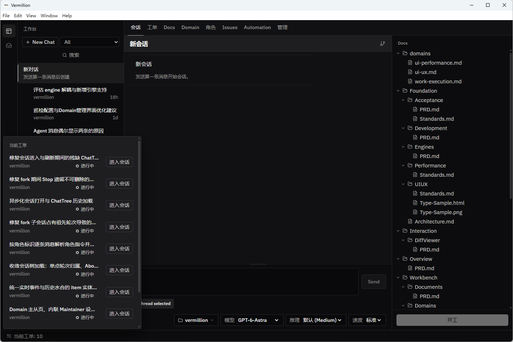

# Vermillion

Vermillion（朱砂）是一款个人 agent 工作台：将对话组织为树，让讨论沉淀为文档和工单，再由 Worker 在 worktree 里异步执行。你只负责参与设计讨论和关键决策。

https://github.com/user-attachments/assets/32f76ad1-74f8-4569-8af3-19a3c273b51a

适配 Codex、pi 等 engine 的wrapper，重点提供两个feature：非线性对话，为你找回灵活度自由感；通过文档-工单工作流解放并行能力，一天单刷上百 commit 不是梦。

## 关键Feature

### 树形对话，多线并行

线性会话对 agent 开发是非常差劲的形态：讨论一个小 bug 到一半，总会想回到之前的节点继续主线，而引擎自带的 rollback 和 fork 使用体验都过于原始。

Vermillion 基于引擎的 fork 能力将对话重组为一棵树。你可以在任意节点分出新分支、直观查看整棵树、随时跳回之前离开的分支继续推进。多个话题可以并行讨论，互不污染上下文；分支都收在同一棵树里，会话列表不会被大量同源标题淹没。

### Spec-driven 工单流

设计讨论是需要人全程投入的同步工作，而执行不是。Vermillion 把两者拆开：

```
      与设计伙伴讨论 ──► 结论写进 .vermillion/docs/ ──► 开工
                                                        │
Inbox：决策卡 / 合入结果 ◄── Worker 在 worktree 中执行 ◄──┘
```

开工后，工作台从当前讨论节点 fork 出 Worker 分支，由它整理文档、建单、在独立 worktree 中执行、完成 review 和验证后提交合入。执行期间只有需要你拍板的问题会以决策卡进入 Inbox。派出工单后，你可以立刻转去讨论下一件事，不用在多个会话之间来回盯进度。
* 当然，对于小活和需要你频繁给反馈的任务，你也完全可以不走开单流程，让主agent完成一切。



### 多引擎

会话引擎可插拔，目前支持 Codex（app-server）和 pi（rpc 模式）。同一棵会话树沿用创建时的引擎；角色 prompt 以 developer instructions 的形式注入，全局版本在 `~/.vermillion/roles/`，每个 workspace 可以覆盖或追加。

## 快速开始

需要 Node >= 22、pnpm 10，以及 PATH 中的 `git` 和 `codex`（可用 `VERMILLION_CODEX_BIN` 指定路径）。

```
start.bat       # Windows：构建并启动桌面应用
start.command   # macOS：构建并启动桌面应用（Finder 中双击）
dev.bat         # Windows 开发模式（Vite HMR + Electron）；macOS 用 pnpm dev
```

1. 在会话页底部 Composer 的 workspace 选择器里选「新建 workspace…」，指向一个项目目录。Vermillion 会按需初始化 git 并创建 `.vermillion/docs/`。
2. 直接发消息开始与设计伙伴讨论。会话 cwd 是 workspace 根，设计伙伴可以阅读整个项目，但只改 `.vermillion/docs/` 下的文档。
3. 讨论清楚后点 Docs 面板底部的 **开工**，或直接说「把 XXX 开工做掉」。之后去 Inbox 处理决策卡和查看合入结果即可。

## 工作台一览

| 分页 | 用途 |
| --- | --- |
| 会话 | 树形对话，右侧 Docs Explorer 直接编辑文档，切页保留草稿 |
| 工单 | 按来源会话树分组，显示调度开关、并发上限、进度与等待原因 |
| Docs | `.vermillion/docs/` 文件树，改动带 M/U/D 标记，右键可提交 |
| Domain | 领域定义与规范索引，Worker 建单时据此附上相关规范 |
| 角色 | 设计伙伴、Worker、Maintainer、Liaison、Reviewer、Verifier 的 prompt 配置 |
| Inbox | 汇总所有 workspace 的决策卡与合入结果，可答复、确认或回滚 |

完整产品行为见 [产品总览](.vermillion/docs/Overview/PRD.md)。

## 开发

```
packages/shared        会话引擎契约（zod）
packages/core          会话领域存储与投影
packages/adapters      运行时适配（codex app-server / pi）
packages/workbench     工作台领域 + typed RPC + CLI
apps/desktop-server    会话引擎宿主（Electron main 进程内）
apps/desktop           Electron 壳：SessionPane + 工作台 / Docs / Inbox
```

CLI 与桌面共用同一个服务和方法表，CLI 的写入会实时反映到桌面：

```
pnpm --filter @vermillion/workbench build
node packages/workbench/bin/vermillion.mjs --help
node packages/workbench/bin/vermillion.mjs workspace.list
```

数据分两处：全局 `~/.vermillion/` 存 workspace 注册表、会话索引和角色 prompt；每个 workspace 的 `<root>/.vermillion/` 中只有 `docs/` 走 git，工单、决策、运行记录等排除在 git 之外。

`pnpm package` 在当前平台产出 `release/vermillion-<version>-<stamp>/`：Windows 为 `Vermillion.exe`，macOS 为 `Vermillion.app`。目录可整体拷走运行，不需要 node_modules。开发检查、隔离验收实例和打包细节见 [docs/development.md](docs/development.md)。

## Roadmap

树形对话、工单流、Inbox 与多引擎已可日常使用。

下列能力已完成设计，等待Tibo重置中：

- **Issues 与领域巡检**：Maintainer 按 Domain 定期巡检代码与文档，把发现的问题登记为 Issue 并分诊；证据充分、方向明确且在领域授权范围内的问题直接转为工单，其余进入调查或等待用户决策。
- **Liaison**：接入 IM，从聊天中收集反馈并归并到 Issues。
- **暂离巡视**：用户离开期间由一个 agent 低频巡视所有未结束的工单，发现卡住或无人推进的情况汇报到 Inbox。
- **Automation**：用户自定义的定时或触发任务，与内部 Worker 调度分离。


## 友情链接
[LINUX DO](https://linux.do) — 新的理想型社区

## License

[MIT](LICENSE)
