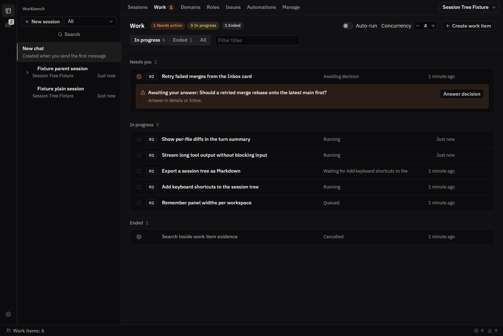

# Vermillion

English | [简体中文](README.zh-CN.md)

Vermillion is a personal agent workbench. It organizes conversations as trees, turns discussions into docs and work items, and lets Workers execute them asynchronously in git worktrees. You take part in design discussions and key decisions; the rest runs on its own.

https://github.com/user-attachments/assets/32f76ad1-74f8-4569-8af3-19a3c273b51a

Vermillion wraps agent engines such as Codex and pi and focuses on two things: non-linear conversations that give you back the freedom to branch and return, and a docs-to-work-items workflow that lets many tasks run in parallel. A hundred commits a day from one person is realistic.

## Key features

### Tree-shaped conversations

Linear chat is a poor fit for agent development. Halfway through a small bug discussion you usually want to return to an earlier point and continue the main line, and the rollback and fork tools that engines ship are too primitive for that.

Vermillion uses the engine's fork capability to rebuild the conversation as a tree. You can branch from any node, see the whole tree at a glance, and jump back to a branch you left earlier. Several topics can move forward in parallel without polluting each other's context, and all branches stay in one tree, so the session list is not flooded with near-duplicate titles.

### Spec-driven work items

Design discussion is synchronous work that needs you present. Execution is not. Vermillion separates the two:

```
   Discuss with the Design Partner ──► Conclusions go into .vermillion/docs/ ──► Start work
                                                                                     │
Inbox: decisions / merge results ◄── Workers execute in worktrees ◄──────────────────┘
```

When you start work, the workbench forks a Worker branch from the current discussion node. The Worker organizes the docs, creates work items, executes them in isolated worktrees, reviews and verifies the result, and submits it for merge. While it runs, only questions that need your call reach the Inbox as decisions. Once work is dispatched you can move straight on to the next discussion instead of watching several sessions.
* For small tasks, or tasks that need frequent feedback from you, you can skip work items entirely and let the main agent do everything.



### Multiple engines

Session engines are pluggable. Codex (app-server) and pi (rpc mode) are supported. A session tree keeps the engine it was created with. Role prompts are injected as developer instructions; the global versions live in `~/.vermillion/roles/`, and each workspace can override or append to them.

The interface is available in English and Chinese. It follows the system language on first launch and can be switched in Settings. Default role prompts ship in both languages.

## Quick start

Requires Node >= 22, pnpm 10, and `git` and `codex` on PATH (set `VERMILLION_CODEX_BIN` to use another path).

```
start.bat       # Windows: build and launch the desktop app
start.command   # macOS: build and launch the desktop app (double-click in Finder)
dev.bat         # Windows dev mode (Vite HMR + Electron); on macOS use pnpm dev
```

1. In the workspace picker at the bottom of the session composer, choose "New workspace…" and point it at a project directory. Vermillion initializes git if needed and creates `.vermillion/docs/`.
2. Send a message to start discussing with the Design Partner. The session cwd is the workspace root, so the Design Partner can read the whole project, but it only edits docs under `.vermillion/docs/`.
3. When the plan is clear, click **Start work** at the bottom of the Docs panel, or just say "start work on XXX". Then handle decisions and review merge results in the Inbox.

## Workbench at a glance

| Page | Purpose |
| --- | --- |
| Sessions | Tree-shaped conversations, with a Docs Explorer on the right for editing docs; drafts survive page switches |
| Work | Grouped by source session tree; shows the scheduler switch, concurrency limit, progress and waiting reasons |
| Docs | The `.vermillion/docs/` file tree with M/U/D change markers; right-click to commit |
| Domains | Domain definitions and standards index; Workers attach the relevant standards when creating work items |
| Roles | Prompt configuration for the Design Partner, Worker, Maintainer, Liaison, Reviewer and Verifier |
| Inbox | Decisions and merge results across all workspaces; answer, acknowledge or roll back |

The full product behavior is described in the [product overview](.vermillion/docs/Overview/PRD.md) (Chinese).

## Development

```
packages/shared        Session engine contract (zod)
packages/core          Session domain store and projections
packages/adapters      Runtime adapters (codex app-server / pi)
packages/workbench     Workbench domain + typed RPC + CLI
apps/desktop-server    Session engine host (inside the Electron main process)
apps/desktop           Electron shell: SessionPane + Workbench / Docs / Inbox
```

The CLI and the desktop app share one service and method table, so CLI writes show up in the desktop app immediately:

```
pnpm --filter @vermillion/workbench build
node packages/workbench/bin/vermillion.mjs --help
node packages/workbench/bin/vermillion.mjs workspace.list
```

Data lives in two places: the global `~/.vermillion/` holds the workspace registry, session index and role prompts; in each workspace, only `docs/` under `<root>/.vermillion/` is tracked by git, while work items, decisions and run records stay out of git.

`pnpm package` builds `release/vermillion-<version>-<stamp>/` for the current platform: `Vermillion.exe` on Windows and `Vermillion.app` on macOS. The folder runs as-is without node_modules. Development checks, isolated acceptance instances and packaging details are in [docs/development.md](docs/development.md).

## Roadmap

Tree-shaped conversations, work items, the Inbox and multiple engines are ready for daily use.

The following are designed and waiting to be built:

- **Issues and domain patrols**: a Maintainer periodically checks code and docs for each Domain, records findings as Issues and triages them. Well-evidenced, clear-cut issues within the Domain's authorized scope become work items directly; the rest go to investigation or wait for your decision.
- **Liaison**: connects to IM, collects feedback from chats and files it into Issues.
- **Away patrol**: while you are away, an agent checks all open work items at a low frequency and reports stuck or unattended work to the Inbox.
- **Automations**: user-defined scheduled or triggered tasks, separate from internal Worker scheduling.

## Links

[LINUX DO](https://linux.do)

## License

[MIT](LICENSE)
